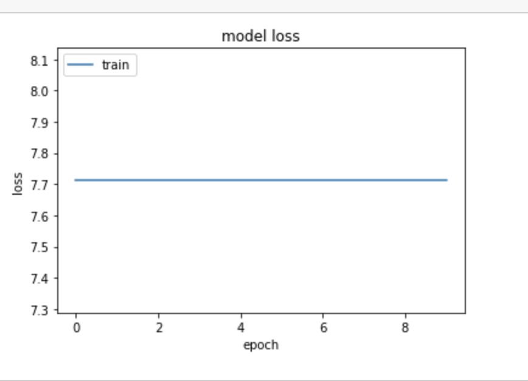
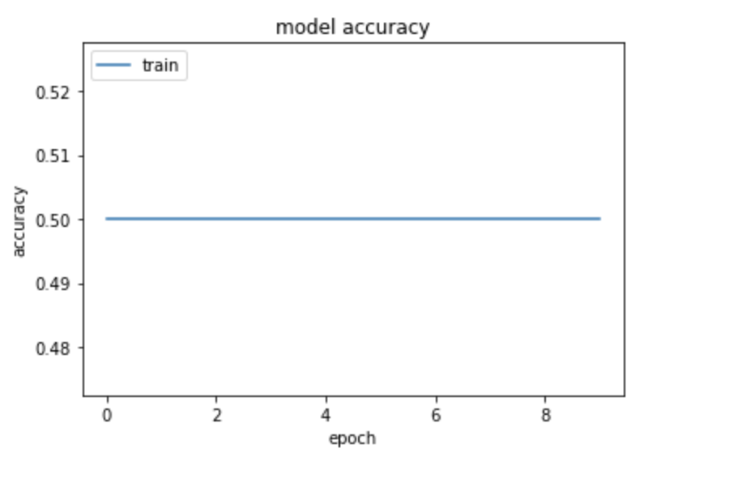

# Violence Detection in Smart Cities

## Goal of the Project
he aim of this project is to develop automatic system to detect dangerous situations Such as fighting, brawls, robberies, and more.

 ## Start building Simple Neural Network (baseline)

Three sequential layers with different activation function (__relu__) was added 

> The above figure represent the loss 

> The above figure represent the accuarcy

## Future Work
- Improve accuracy scores
- Using Transfer Learning (VGG16)

